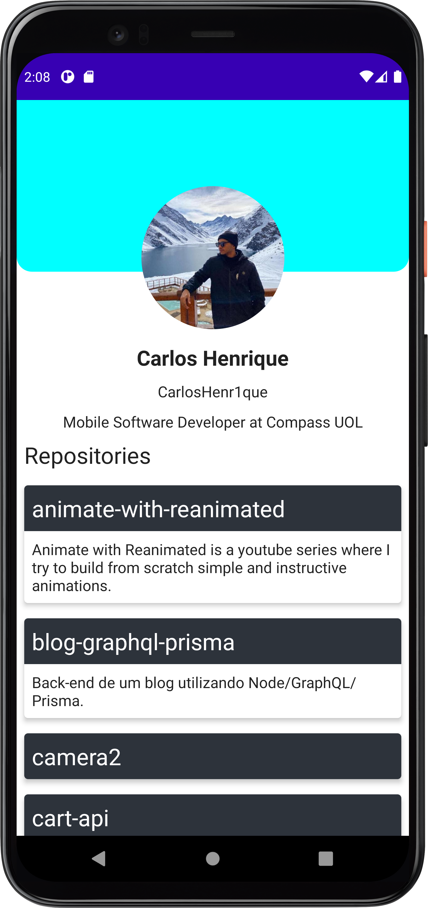
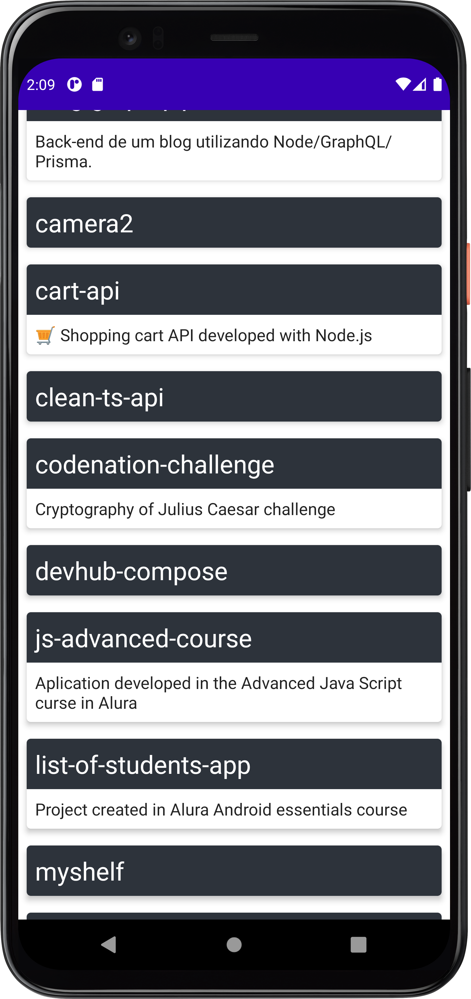

<h1 align="center">
  DevHub - Compose 📱
</h1>

<h4 align="center">
  Aplicação Mobile desenvolvida em Android utilizando Jetpack Compose
</h4>

  
  &nbsp;
  

## Sobre o projeto 💡
Esse projeto foi desenvolvido durante o evento #7DaysOfCode da Alura. O intuito desse evento é desenvolver uma aplicação durante 7 dias.
Durante a semana foi desenvolvido uma aplicação que consome a API pública do Github e apresenta as informações de um perfil específico e seus repositórios.

## Funcionalidades

- Apresentar informações do perfil do GitHub.
- Listar repositórios do perfil selecionado.

## Aprendizados

Esse foi meu primeiro contato com o desenvolvimento de interfaces no Android utilizando o kit de UI Jetpack Compose.
Tive oportunidade de aprender como criar meus compoentes @composable, entender seu ciclo de vida e seu gerenciamento de estado.
